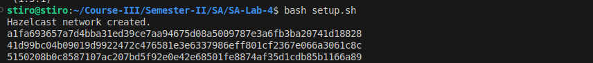
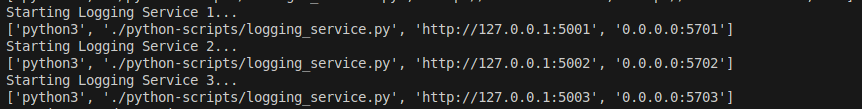
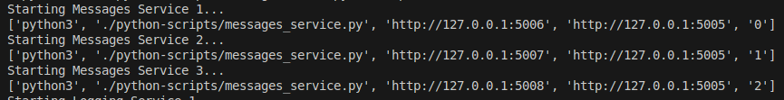
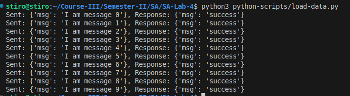
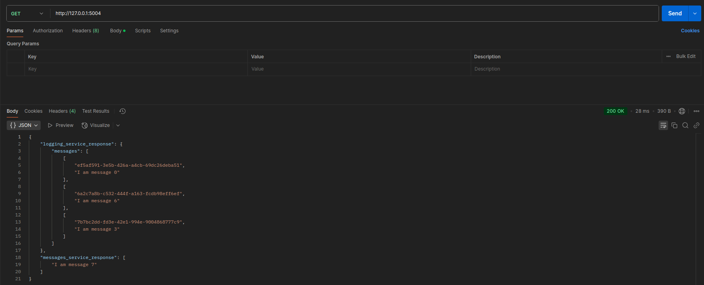
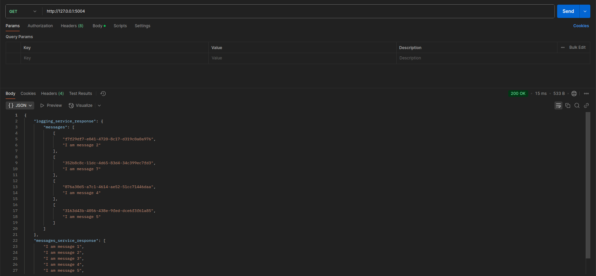
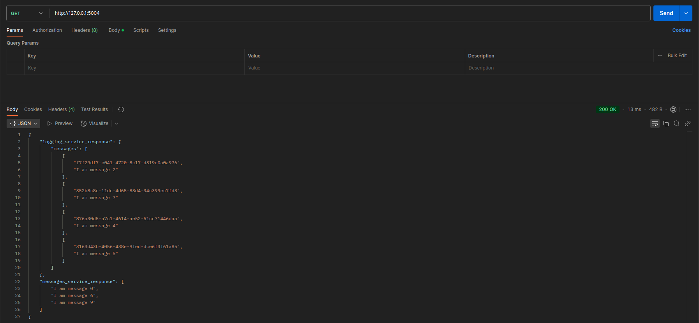

# SA-Lab-4

Author: Davyd Ilnytskyi

Queue: Kafka

---

###
```
pip install -r requirements.txt
```

### Setup 
```
bash setup.sh
```

### Remove containers
`Ctrl+C` to stop servers
```
bash shutdown.sh
```

---

# Tasks

#### 1. Запустити три екземпляра logging-service (локально їх можна запустити на різних портах), відповідно мають запуститись також три екземпляра Hazelcast
**Hazelcast containers creation:**


**Logging service creation:**

#### 2. Запустити три екземпляри messages-service (локально їх можна запустити на різних портах)

#### 3. Через HTTP POST записати 10 повідомлень msg1-msg10 через facade-service


#### 4. Показати які повідомлення отримав кожен з екземплярів logging-service (це має бути видно у логах сервісу)
**logging_service_5001.txt**
```
18:25:14: Starting up server 127.0.0.1:5001
18:25:14: Connecting to Hazelcase client
18:25:14: Connected to Hazelcase client
18:25:38: Post request
18:25:38: Added key: 4d0e0a2c-e087-4b66-8aff-1fca588d9079 with value: I am message 1 by logging service: http://127.0.0.1:5001
18:25:39: Post request
18:25:39: Added key: 974b970c-10af-4931-aa94-dd8e894e8ded with value: I am message 8 by logging service: http://127.0.0.1:5001
18:25:39: Post request
18:25:39: Added key: 74e15bee-ad3c-4594-9798-7c99b301579c with value: I am message 9 by logging service: http://127.0.0.1:5001

```
**logging_service_5002.txt**
```
18:25:14: Starting up server 127.0.0.1:5002
18:25:14: Connecting to Hazelcase client
18:25:14: Connected to Hazelcase client
18:25:38: Post request
18:25:38: Added key: ef5af591-3e5b-426a-a4cb-69dc26deba51 with value: I am message 0 by logging service: http://127.0.0.1:5002
18:25:39: Post request
18:25:39: Added key: 7b7bc2dd-fd3e-42e1-994e-9004868777c9 with value: I am message 3 by logging service: http://127.0.0.1:5002
18:25:39: Post request
18:25:39: Added key: 6a2c7a8b-c532-444f-a163-fcdb98eff6ef with value: I am message 6 by logging service: http://127.0.0.1:5002
```
**logging_service_5003.txt**
```
18:25:14: Starting up server 127.0.0.1:5003
18:25:14: Connecting to Hazelcase client
18:25:14: Connected to Hazelcase client
18:25:39: Post request
18:25:39: Added key: f7f29df7-e041-4720-8c17-d319c0a0a976 with value: I am message 2 by logging service: http://127.0.0.1:5003
18:25:39: Post request
18:25:39: Added key: 876a30d5-a7c1-4614-ae52-51cc71446daa with value: I am message 4 by logging service: http://127.0.0.1:5003
18:25:39: Post request
18:25:39: Added key: 3163d43b-4056-438e-9fed-dce6f3f61a85 with value: I am message 5 by logging service: http://127.0.0.1:5003
18:25:39: Post request
18:25:39: Added key: 352b8c8c-11dc-4d65-83d4-34c399ec7fd3 with value: I am message 7 by logging service: http://127.0.0.1:5003
```

#### 5. Показати які повідомлення отримав кожен з екземплярів messages-service (це має бути видно у логах сервісу)
**messages_service_5006**
```
18:25:14: Starting up server: 127.0.0.1:5006
18:25:14: Kafka Consumer Connected
18:25:38: New message received: I am message 0
18:25:41: New message received: I am message 6
18:25:41: New message received: I am message 9
```
**messages_service_5007**
```
18:25:14: Starting up server: 127.0.0.1:5007
18:25:14: Kafka Consumer Connected
18:25:39: New message received: I am message 1
18:25:42: New message received: I am message 2
18:25:42: New message received: I am message 3
18:25:42: New message received: I am message 4
18:25:42: New message received: I am message 5
18:25:42: New message received: I am message 8
```
**messages_service_5008**
```
18:25:14: Starting up server: 127.0.0.1:5008
18:25:14: Kafka Consumer Connected
18:25:42: New message received: I am message 7
```
#### 6. Декілька разів викликати HTTP GET на facade-service та отримати об'єднані дві множини повідомлень - це мають бути повідомлення з logging-service та messages-service



