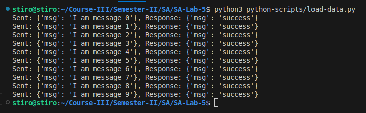
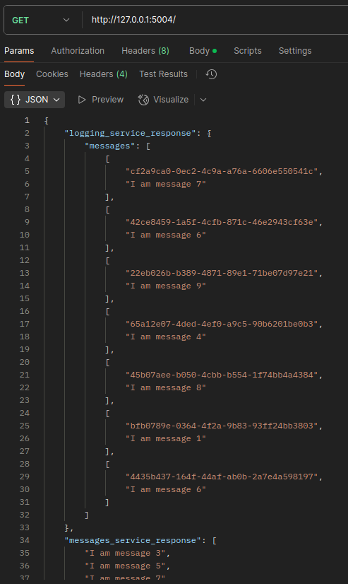
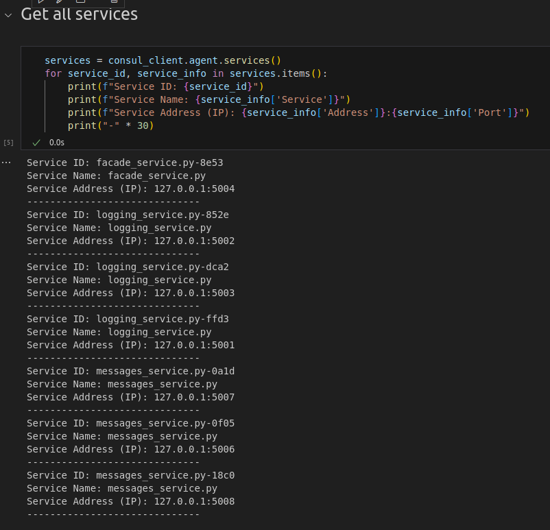

# SA-Lab-4

Author: Davyd Ilnytskyi

Queue: Kafka

---

###
```
pip install -r requirements.txt
```

### Setup 
```
bash setup.sh
```

### Remove containers
`Ctrl+C` to stop servers
```
bash shutdown.sh
```

---

# Tasks

### У протоколі має міститись:
##### Скріншоти з POST/GET-запитами та відповіді на них:
**Post Request**\
\
**Get Request**\
\

##### Вміст консолі кожного з мікросевісу якщо туди виводиться якась корисна інформація
- вміст консолей у папці logs
##### Cкріншот з Consul який би показував зареєстровані в ньому мікросервіси

